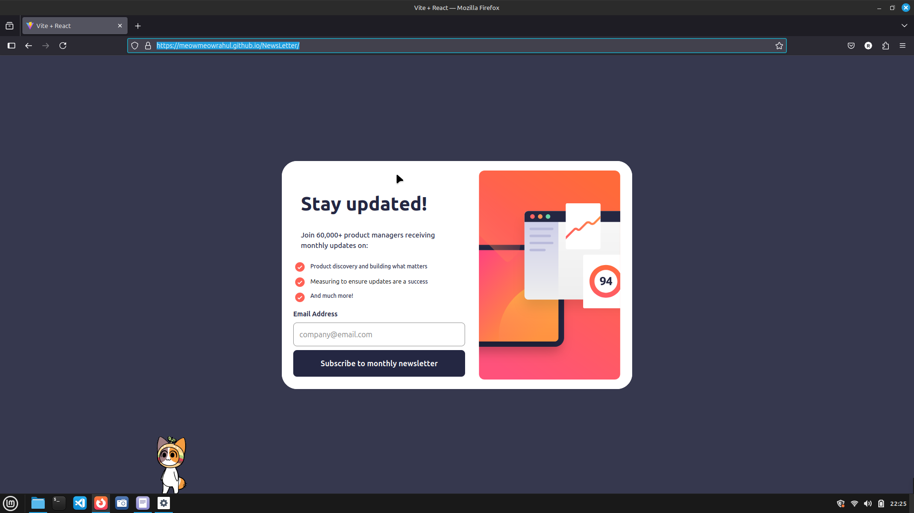

# 📬 Newsletter Signup Component

This is my solution to the [Newsletter sign-up form challenge on Frontend Mentor](https://www.frontendmentor.io/challenges/newsletter-signup-form-with-success-message-5PNrBV5YLu). It’s a responsive, interactive newsletter form built using **React**, styled with **Tailwind CSS**, and powered by **Vite** for a fast and modern development experience.

---

## 🔗 Live Demo

[View Live Site](https://meowmeowrahul.github.io/NewsLetter/)  

---
## 📸 Screenshot

---

## 🛠️ Built With

- [React](https://reactjs.org/)
- [Tailwind CSS](https://tailwindcss.com/)
- [Vite](https://vitejs.dev/)
- JSX + Hooks
- Responsive & accessible form layout

---

## ✨ Features

- Fully responsive design
- Custom form input validation
- Dynamic email field state
- Styled components with Tailwind
- Email placeholder & button hover effect
- Clean separation of UI and logic using React components

---

## 💡 What I Learned

- How to scaffold a React project using Vite for faster builds
- Tailwind layout techniques for responsive cards (`grid`, `flex`, `gap`)
- Managing form state with React (`useState`)
- Basic form validation and input styling
- Improving accessibility with proper form labels and ARIA attributes

---
## 📚 Useful Resources

- Tailwind Form Styling

- Vite + React Setup Guide

- React useState Docs

- Frontend Mentor Challenge

## 👤 Author

- GitHub – @meowmeowrahul

- Frontend Mentor – @meowmeowrahul

## 🙌 Acknowledgments

  Thanks to Frontend Mentor for the challenge and community feedback!
